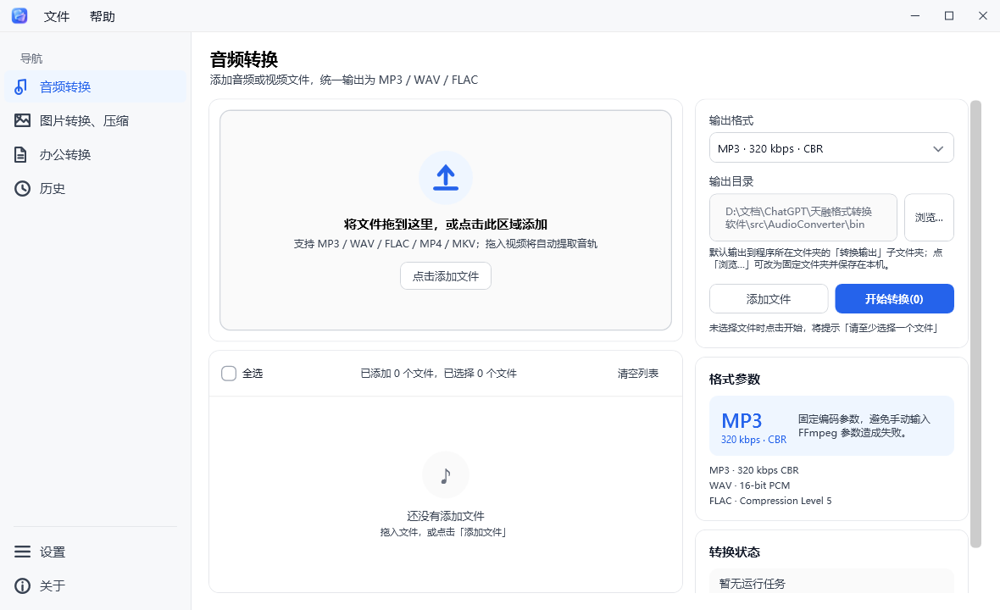
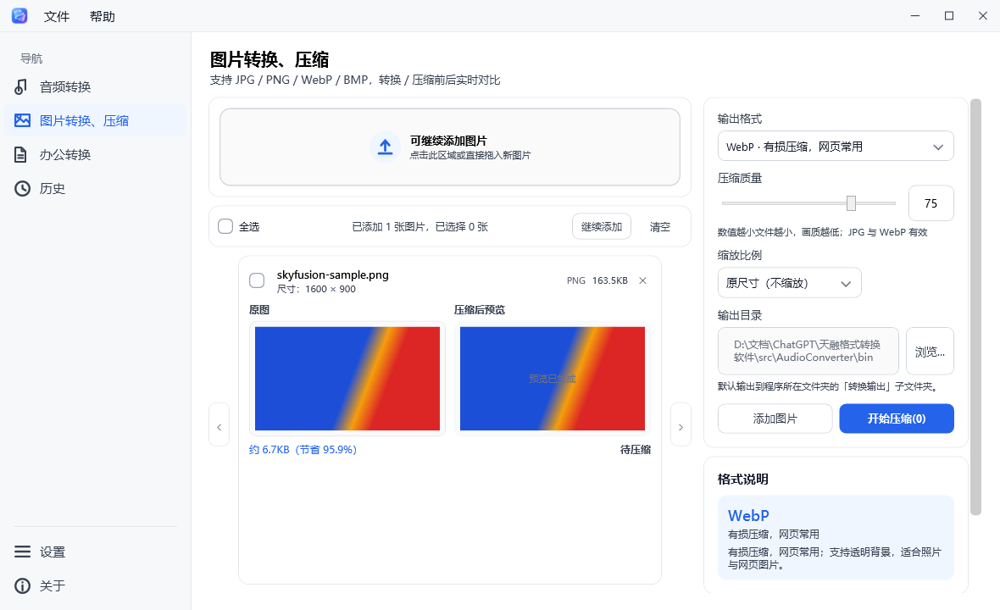

# 天融 SkyFusion

**天融万物，格式无界 · Fuse Anything, Convert Anything**

[](docs/VERSIONS.md)
[](LICENSE)
[](#系统要求)
[](#系统要求)
[](#技术栈与设计约束)
[](https://github.com/p1816057-cpu/-/releases/latest)

天融（SkyFusion）是一款 **完全离线的 Windows 桌面格式转换工具**：音频转换、图片转换与压缩，
本地调用 FFmpeg 7.0，不联网、不注入、无后台服务，兼容 Windows 7 SP1 x64 到 Windows 11。

当前版本：**v1.2.1**（完整变更见 [`docs/VERSIONS.md`](docs/VERSIONS.md)）

## 界面预览

音频转换（拖拽添加、批量勾选、顺序任务队列）



图片转换、压缩（实时预览与体积对比，左栏导航已改名）



## 功能

**音频转换**

- 拖拽或点选添加 MP3 / WAV / FLAC / MP4 / MKV，自动识别音频与视频（视频自动提取音轨）
- 固定编码参数：MP3 320 kbps CBR、WAV 16-bit PCM、FLAC Compression Level 5
- 三态全选、独立勾选、实时计数；顺序任务队列（进度 / 速度 / 取消 / 自动重试 / 冲突策略）

**图片转换、压缩**

- 输入 JPG / PNG / WebP / BMP，输出 WebP / JPG / PNG
- 画质滑块与数值输入联动、等比缩放；实时生成压缩后预览并对比体积

**输出位置（v1.2.1 起）**

- 默认输出到「程序所在文件夹」下自动创建的 `转换输出` 子文件夹，换电脑不会沿用其它电脑的路径
- 设置页可选三种模式：程序所在文件夹（默认）/ 与源文件相同文件夹 / 自定义固定文件夹
- 程序目录不可写（例如装在 `C:\Program Files`）时自动回退到源文件所在文件夹，保证转换不失败

**其它**

- 历史记录：最近 200 条，本机 JSON 持久化，支持排序 / 搜索 / 按格式筛选 / 打开输出位置
- 设置页：顶部常驻操作栏（导出日志 / 恢复默认 / 保存设置），未改动时「保存设置」不可点击
- 单实例保护：同一个登录会话重复启动会提示，并把已打开的窗口恢复到前台
- 提示弹窗：模态 + 主窗口遮罩 + 背景虚化，弹窗期间主界面不可误操作
- 诊断：一键导出运行日志与系统信息，便于反馈问题

## 下载与使用

**下载地址：<https://github.com/p1816057-cpu/-/releases/latest>**（也可以从仓库右侧的 Releases 进入）

- **便携版**：下载 `SkyFusion-v1.2.1-Win10-11-portable.zip`，解压后双击 `SkyFusion.exe` 即可，无需安装；
- **安装版**：下载 `SkyFusion-Setup-1.2.1.exe`，按向导安装，可在「应用和功能」里卸载。

详细步骤见 [`docs/使用说明-便携版-Win10-11.txt`](docs/使用说明-便携版-Win10-11.txt)。

## 系统要求

- Windows 7 SP1 x64 / Windows 10 x64 / Windows 11 x64（32 位系统不支持）
- .NET Framework 4.8（Win10 1903+ 与 Win11 自带；Win7 需自行安装）
- Win7 还需要 KB4490628、KB4474419、KB4019990 三个系统补丁

## 构建

需要 .NET SDK（用于还原 `Microsoft.NETFramework.ReferenceAssemblies`，无需 Visual Studio）：

```powershell
dotnet build AudioConverter.sln -c Release
```

输出：

```
src/AudioConverter/bin/Release/net48/SkyFusion.exe
src/AudioConverter/bin/Release/net48/ffmpeg/bin/ffmpeg.exe
src/AudioConverter/bin/Release/net48/ffmpeg/bin/ffprobe.exe
```

FFmpeg 放在 `tools/ffmpeg/bin/`（未纳入版本控制），构建时会自动复制到输出目录。

## 目录结构

```
AudioConverter.sln
src/AudioConverter/
├─ App.xaml(.cs)          启动、单实例检测、全局异常兜底
├─ Shell/                 自定义标题栏、侧栏导航、页面缓存
├─ Modules/               业务模块（Conversion / ImageCompression / History / Settings / About / Office）
├─ Components/            公共控件（EmptyState、TriStateCheckBox）
├─ Theme/                 Theme.xaml（色板与控件模板）、Converters
├─ Core/                  纯转换逻辑：FFmpeg/FFprobe、任务队列、输出路径解析
├─ Services/              组合根、设置、历史、提示弹窗、日志
├─ Data/                  JSON 轻量持久化
├─ Models/                领域模型与枚举
└─ Assets/                程序图标（app.ico / app-logo.png）
docs/                     架构、版本、验收、开发提示词与使用说明
scripts/                  Inno Setup 安装脚本、签名脚本
tools/ffmpeg/bin/         FFmpeg 运行文件（构建时复制，不入库）
```

## 数据与输出位置

- 设置：`%APPDATA%\AudioConverter\settings.json`（每台电脑独立，不写注册表）
- 历史：`%APPDATA%\AudioConverter\history.json`
- 日志：`%APPDATA%\AudioConverter\logs\app.log`
- 转换结果：默认在程序目录下的 `转换输出`（见上文"输出位置"）

## 技术栈与设计约束

- C# / WPF / MVVM，`net48`、`LangVersion 8.0`、`x64`
- 唯一编译期 NuGet 包：`Microsoft.NETFramework.ReferenceAssemblies`（仅用于在无 VS 环境编译）
- JSON 持久化只用 .NET 自带 `DataContractJsonSerializer`，不引入第三方库
- FFmpeg 只以独立进程方式调用（`ProcessStartInfo` + 重定向输出 + `CreateNoWindow`）
- 不使用 Win8+ 专属 API，不使用 WebView / 本地 HTTP 服务 / Node / Electron
- 分层调用链：Views → ViewModels → Services → Core → ffmpeg.exe

## 许可与第三方

- 本项目源码采用 MIT License，见 [`LICENSE`](LICENSE)
- 发布包内含 FFmpeg（GPLv3）与其许可说明，第三方声明见 [`THIRD-PARTY-NOTICES.md`](THIRD-PARTY-NOTICES.md)
- FFmpeg 以独立进程调用，不参与本项目源码编译链接

## 已知限制

- 程序未做数字签名，个别安全软件可能对未签名 exe 误报，添加信任即可
- 图标（.ico）转换功能尚未实现，正在评估中
- 「办公转换」为占位入口，尚未实现
